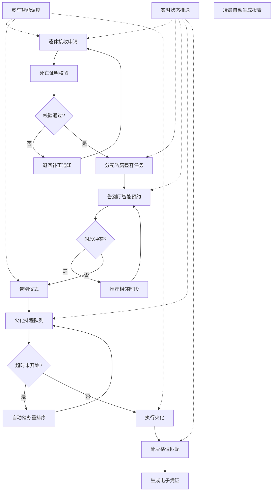

## 1. 产品概述

殡仪馆智能运营管理系统，实现遗体接收、告别、火化、存放全流程数字化管理，智能调度各类资源，实时推送状态信息，提升服务效率与家属体验。
- 解决殡仪馆业务流程分散、资源调度低效、信息传递不及时等痛点
- 面向殡仪馆工作人员（管理员、调度员、业务员、司机）及逝者家属
- 实现全流程自动化、智能化、透明化运营

## 2. 核心功能

### 2.1 用户角色

| 角色 | 登录方式 | 核心权限 |
|------|----------|----------|
| 系统管理员 | 账号密码登录 | 用户管理、系统配置、报表查看、全部权限 |
| 业务调度员 | 账号密码登录 | 遗体接收审核、告别厅预约、火化排程、灵车调度 |
| 防腐整容师 | 账号密码登录 | 查看防腐整容任务、更新任务状态 |
| 火化操作员 | 账号密码登录 | 查看火化任务、更新火化状态、录入炉况 |
| 灵车司机 | 账号密码登录 | 查看出车任务、更新行车状态、上报位置 |
| 逝者家属 | 手机号/身份证号登录 | 查看流程进度、告别厅预约、接收通知消息 |

### 2.2 功能模块

1. **工作台首页**：数据概览、今日任务、待办提醒、实时通知
2. **遗体接收管理**：死亡证明校验、公安备案验证、基本信息录入、退回补正
3. **防腐整容管理**：任务分配、状态跟踪、质量记录
4. **告别厅管理**：厅室资源、智能预约、冲突处理、时段锁定
5. **火化管理**：炉型匹配、燃料监控、排程队列、超时催办
6. **骨灰存放管理**：格位匹配、电子凭证、家属信息管理
7. **灵车调度管理**：车辆分配、最优路线、实时跟踪、负载监控
8. **运营报表中心**：厅使用率、火化完成率、灵车准点率、Excel导出
9. **消息通知中心**：实时推送、状态变更通知、调度指令

### 2.3 页面详情

| 页面名称 | 模块名称 | 功能描述 |
|----------|----------|----------|
| 工作台首页 | 数据概览卡片 | 展示今日接收数、告别场次、火化数量、在途车辆核心指标 |
| 工作台首页 | 今日任务列表 | 按优先级展示待办任务，支持快速跳转处理 |
| 工作台首页 | 实时通知栏 | 滚动展示最新状态变更和调度指令 |
| 工作台首页 | 趋势图表 | 展示近7天业务量趋势折线图 |
| 遗体接收页 | 接收登记表单 | 录入逝者信息、家属信息、死亡证明信息 |
| 遗体接收页 | 校验结果面板 | 展示死亡证明和公安备案校验结果，标注异常项 |
| 遗体接收页 | 退回补正弹窗 | 选择补正事项，填写退回原因，发送通知 |
| 遗体接收页 | 接收记录列表 | 展示历史接收记录，支持搜索、筛选、查看详情 |
| 防腐整容页 | 任务分配面板 | 根据遗体状态智能推荐任务，支持手动调整 |
| 防腐整容页 | 任务进度看板 | 按待处理/进行中/已完成分栏展示任务卡片 |
| 告别厅管理页 | 厅室资源总览 | 展示各厅室容量、设施、当日预约状态时间轴 |
| 告别厅管理页 | 智能预约表单 | 输入人数、时长、偏好时段，系统智能推荐厅室 |
| 告别厅管理页 | 冲突处理弹窗 | 时段冲突时展示相邻可选时段，支持一键切换 |
| 告别厅管理页 | 预约日历 | 按日历视图展示各厅室预约情况，支持拖拽调整 |
| 火化管理页 | 排程队列看板 | 按预约顺序展示火化队列，标注炉型、燃料状态 |
| 火化管理页 | 炉况监控面板 | 展示各火化炉运行状态、燃料余量、预计完成时间 |
| 火化管理页 | 超时催办按钮 | 超时任务高亮，一键催办并自动重新排序 |
| 骨灰存放页 | 格位资源图 | 可视化展示存放区格位分布，标注类型、占用状态 |
| 骨灰存放页 | 匹配推荐面板 | 自动匹配可用格位，展示位置、价格、剩余年限 |
| 骨灰存放页 | 电子凭证生成 | 生成带二维码的电子存放凭证，支持打印和分享 |
| 灵车调度页 | 车辆状态总览 | 展示所有车辆位置、负载、油耗、司机状态 |
| 灵车调度页 | 智能调度表单 | 输入出发地、目的地、时间，系统推荐车辆和最优路线 |
| 灵车调度页 | 实时轨迹地图 | 在地图上展示车辆实时位置和行驶轨迹 |
| 运营报表页 | 核心指标卡片 | 厅使用率、火化完成率、灵车准点率、平均服务时长 |
| 运营报表页 | 数据图表 | 各类业务数据的柱状图、饼图、折线图展示 |
| 运营报表页 | 筛选导出面板 | 按日期、区域筛选，一键导出Excel报表 |
| 消息通知页 | 通知分类列表 | 按业务类型、紧急程度分类展示消息 |
| 消息通知页 | 消息详情弹窗 | 展示消息详情，关联业务单据，支持快速跳转 |

## 3. 核心流程

遗体从接收到骨灰存放的完整业务流程：家属或业务员发起遗体接收申请，系统自动校验死亡证明有效性和公安备案状态，校验不合格则退回并通知补正，校验通过后录入系统。根据遗体状态自动分配防腐整容任务，同步查询告别厅可用时段。告别厅预约根据丧属人数和祭奠时长智能匹配厅室并锁定时段，如遇冲突则推荐相邻可选时段。根据炉型、燃料余量和预约顺序自动生成火化排程队列，超时未开始自动催办并重新排序。火化完成后自动匹配格位类型与位置，生成电子存放凭证。全流程中灵车根据距离和负载智能调度，所有状态变更实时推送给工作人员和家属。每日凌晨自动生成运营报表，支持按日期和区域导出。

## 4. 用户界面设计

### 4.1 设计风格

- **主色调**：深邃灰蓝 (#1e293b) 作为主色，传递庄重、专业、可信赖的氛围
- **辅助色**：沉稳墨绿 (#0f766e) 用于成功/完成状态，暖琥珀 (#d97706) 用于警示/待办，深红 (#dc2626) 用于错误/紧急状态
- **中性色**：石板灰系列 (slate-50 ~ slate-900)，构建清晰的层次感
- **按钮风格**：微圆角 (rounded-lg)，微妙阴影，悬停时轻微上浮 + 阴影加深
- **字体方案**：标题使用 Noto Serif SC（宋体风格，庄重典雅），正文使用 Noto Sans SC（黑体风格，清晰易读）
- **布局风格**：左侧导航 + 顶部栏 + 主内容区三栏式，卡片化布局，适度留白
- **图标风格**：使用 Lucide 线性图标，统一 20px 尺寸，与文字垂直居中对齐
- **装饰元素**：细微噪点纹理背景，柔和渐变色块，低对比度分隔线

### 4.2 页面设计概览

| 页面名称 | 模块名称 | UI元素 |
|----------|----------|----------|
| 工作台首页 | 数据概览卡片 | 渐变背景卡片，大号数字 + 趋势小箭头，悬停微动效 |
| 工作台首页 | 今日任务列表 | 列表项左侧彩色状态条，优先级标签，快捷操作按钮 |
| 工作台首页 | 实时通知栏 | 顶部滚动条，新消息高亮脉冲动画，点击展开 |
| 遗体接收页 | 校验结果面板 | 校验项逐条展示，成功/失败图标，异常项红色展开详情 |
| 告别厅管理页 | 厅室时间轴 | 横向时间轴，色块标注占用状态，悬停显示预约详情 |
| 告别厅管理页 | 预约日历 | 月视图日历，格内迷你热力图，拖拽预约时段 |
| 火化管理页 | 排程队列看板 | 竖向队列卡片，炉型图标，进度条，超时任务红色闪烁边框 |
| 灵车调度页 | 实时轨迹地图 | 地图底图，车辆标记点，轨迹连线，位置刷新脉冲动画 |
| 运营报表页 | 数据图表 | ECharts 图表，渐变色填充，图例切换动画，数据标签 |
| 运营报表页 | 筛选导出面板 | 下拉筛选器，日期范围选择器，主色调导出按钮 |

### 4.3 响应式设计

- **桌面优先**：以 1440px 宽度为基准设计，适配 1280px ~ 1920px 常见分辨率
- **平板适配**：1024px 断点，左侧导航收起为图标模式，卡片两列排布
- **移动端适配**：768px 断点，底部 Tab 导航替代侧边栏，卡片单列排布，表格转为卡片列表
- **触摸优化**：可点击区域最小 44px，重要操作按钮使用底部悬浮栏，支持下拉刷新

### 4.4 动效与交互细节

- **页面加载**：主体内容淡入 (opacity 0→1, 300ms ease)，卡片依次错峰出现 (stagger 50ms)
- **状态变更**：状态标签颜色切换时伴随轻微缩放脉冲 (scale 1→1.1→1, 200ms)
- **表单校验**：错误提示从下往上滑入，红色边框微弱闪烁
- **通知推送**：右上角 Toast 滑入，停留 4 秒后滑出，支持手动关闭
- **卡片悬停**：translateY(-2px) + 阴影加深 transition 150ms
