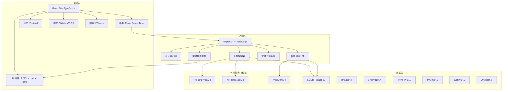
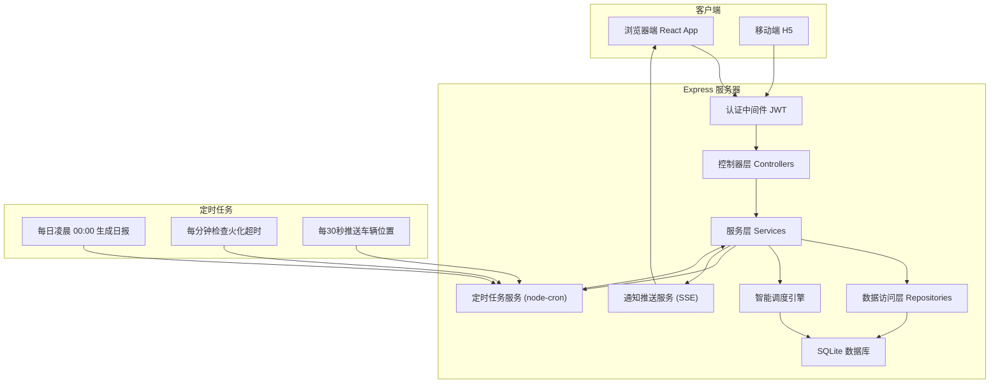
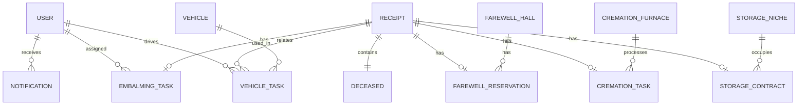

## 1. 架构设计



## 2. 技术说明

- **前端**: React@18 + TypeScript + Vite
- **路由**: react-router-dom@6
- **状态管理**: zustand@4
- **样式**: tailwindcss@3
- **图表**: echarts@5 + echarts-for-react
- **图标**: lucide-react
- **Excel导出**: xlsx
- **初始化工具**: vite-init
- **后端**: Express@4 + TypeScript (ESM)
- **数据库**: SQLite (better-sqlite3)，使用 mock 数据模拟
- **实时推送**: SSE (Server-Sent Events)
- **定时任务**: node-cron
- **HTTP客户端**: axios

## 3. 路由定义

| 路由路径 | 页面名称 | 说明 |
|----------|----------|------|
| /login | 登录页 | 用户登录入口 |
| /dashboard | 工作台首页 | 数据概览、今日任务、实时通知 |
| /receipt | 遗体接收管理 | 接收登记、校验、退回补正 |
| /embalming | 防腐整容管理 | 任务分配、进度跟踪 |
| /farewell | 告别厅管理 | 厅室资源、智能预约、日历 |
| /cremation | 火化管理 | 排程队列、炉况监控、催办 |
| /storage | 骨灰存放管理 | 格位匹配、电子凭证 |
| /vehicle | 灵车调度管理 | 车辆分配、路线、轨迹跟踪 |
| /reports | 运营报表中心 | 数据统计、图表、Excel导出 |
| /notifications | 消息通知中心 | 消息列表、详情、分类 |

## 4. API 定义

### 4.1 认证相关

```typescript
interface LoginRequest {
  username: string;
  password: string;
}

interface LoginResponse {
  token: string;
  user: {
    id: string;
    name: string;
    role: 'admin' | 'dispatcher' | 'embalmer' | 'cremator' | 'driver' | 'family';
    avatar?: string;
  };
}

// POST /api/auth/login
```

### 4.2 遗体接收相关

```typescript
interface DeceasedInfo {
  id?: string;
  name: string;
  gender: 'male' | 'female';
  age: number;
  idCard: string;
  dateOfDeath: string;
  causeOfDeath: string;
  deathCertificateNo: string;
  policeRecordNo: string;
  status: 'pending' | 'verified' | 'rejected' | 'processing';
  familyName: string;
  familyPhone: string;
  familyRelation: string;
  receiptTime?: string;
  verificationResult?: {
    deathCertValid: boolean;
    policeRecordValid: boolean;
    issues: string[];
  };
}

// GET    /api/receipts?status=&keyword=       获取接收记录列表
// POST   /api/receipts                        创建接收登记
// GET    /api/receipts/:id                    获取接收详情
// PUT    /api/receipts/:id/verify             执行校验（死亡证明+公安备案）
// PUT    /api/receipts/:id/reject             退回补正
// POST   /api/receipts/:id/assign-embalming   分配防腐整容任务
```

### 4.3 防腐整容相关

```typescript
interface EmbalmingTask {
  id: string;
  receiptId: string;
  deceasedName: string;
  bodyCondition: 'normal' | 'damaged' | 'advanced_decay';
  taskType: 'preservation' | 'cosmetics' | 'both';
  assigneeId?: string;
  assigneeName?: string;
  status: 'pending' | 'in_progress' | 'completed';
  priority: 'low' | 'normal' | 'high' | 'urgent';
  estimatedDuration: number;
  startTime?: string;
  endTime?: string;
  notes?: string;
}

// GET    /api/embalming/tasks?status=         获取任务列表
// POST   /api/embalming/tasks                 创建任务
// PUT    /api/embalming/tasks/:id/status      更新任务状态
// PUT    /api/embalming/tasks/:id/assign      分配任务
```

### 4.4 告别厅相关

```typescript
interface FarewellHall {
  id: string;
  name: string;
  capacity: number;
  facilities: string[];
  floor: number;
  status: 'available' | 'maintenance';
}

interface FarewellReservation {
  id?: string;
  hallId: string;
  hallName?: string;
  receiptId: string;
  deceasedName: string;
  attendeeCount: number;
  durationMinutes: number;
  startTime: string;
  endTime: string;
  status: 'reserved' | 'in_progress' | 'completed' | 'cancelled';
  familyName: string;
  familyPhone: string;
}

interface HallSuggestion {
  hallId: string;
  hallName: string;
  capacity: number;
  suggestedSlots: { startTime: string; endTime: string }[];
  conflictSlots: { startTime: string; endTime: string; reason: string }[];
  alternativeSlots: { startTime: string; endTime: string }[];
}

// GET    /api/farewell/halls                      获取厅室列表
// GET    /api/farewell/halls/:id/schedule?date=   获取厅室当日排程
// GET    /api/farewell/suggest                    智能推荐厅室和时段
// POST   /api/farewell/reservations               创建预约
// PUT    /api/farewell/reservations/:id           修改预约
// DELETE /api/farewell/reservations/:id           取消预约
```

### 4.5 火化相关

```typescript
interface CremationFurnace {
  id: string;
  name: string;
  type: 'standard' | 'premium' | 'environmental';
  fuelType: 'gas' | 'oil' | 'electric';
  fuelLevel: number;
  status: 'idle' | 'running' | 'maintenance';
  currentTaskId?: string;
  estimatedFinishTime?: string;
}

interface CremationTask {
  id: string;
  receiptId: string;
  deceasedName: string;
  furnaceId?: string;
  furnaceName?: string;
  furnaceType: string;
  queuePosition: number;
  scheduledTime: string;
  startTime?: string;
  endTime?: string;
  status: 'queued' | 'pending' | 'in_progress' | 'completed' | 'overdue';
  estimatedDuration: number;
  overdue: boolean;
}

// GET    /api/cremation/furnaces                  获取火化炉列表
// GET    /api/cremation/tasks?status=             获取火化任务队列
// POST   /api/cremation/tasks/generate-queue      自动生成排程队列
// PUT    /api/cremation/tasks/:id/start           开始火化
// PUT    /api/cremation/tasks/:id/complete        完成火化
// POST   /api/cremation/tasks/:id/remind          催办超时任务
// PUT    /api/cremation/tasks/reorder             重新排序队列
```

### 4.6 骨灰存放相关

```typescript
interface StorageNiche {
  id: string;
  area: string;
  row: number;
  col: number;
  level: number;
  type: 'single' | 'double' | 'family';
  price: number;
  status: 'available' | 'occupied' | 'reserved' | 'maintenance';
}

interface StorageContract {
  id?: string;
  nicheId: string;
  nicheInfo?: { area: string; row: number; col: number; level: number; type: string };
  receiptId: string;
  deceasedName: string;
  familyName: string;
  familyPhone: string;
  familyIdCard: string;
  startDate: string;
  endDate: string;
  years: number;
  status: 'active' | 'expired' | 'transferred';
  certificateNo: string;
  qrCode?: string;
}

// GET    /api/storage/niches?area=&status=        获取格位列表
// GET    /api/storage/niches/map?area=            获取格位分布图
// GET    /api/storage/match?receiptId=&type=      智能匹配格位
// POST   /api/storage/contracts                   创建存放合同
// GET    /api/storage/contracts/:id/certificate   生成电子凭证
```

### 4.7 灵车调度相关

```typescript
interface Vehicle {
  id: string;
  plateNo: string;
  model: string;
  type: 'sedan' | 'van' | 'luxury';
  capacity: number;
  currentLoad: number;
  fuelLevel: number;
  status: 'idle' | 'in_transit' | 'maintenance';
  driverId?: string;
  driverName?: string;
  currentLocation: { lat: number; lng: number; address: string };
}

interface VehicleTask {
  id?: string;
  vehicleId: string;
  vehiclePlate?: string;
  driverId: string;
  driverName?: string;
  receiptId?: string;
  taskType: 'pickup' | 'transfer' | 'delivery';
  origin: { address: string; lat: number; lng: number };
  destination: { address: string; lat: number; lng: number };
  scheduledTime: string;
  estimatedDuration: number;
  distanceKm: number;
  status: 'pending' | 'in_progress' | 'completed' | 'delayed';
  route: { lat: number; lng: number }[];
  currentPosition?: { lat: number; lng: number; timestamp: string };
  trackLog: { lat: number; lng: number; timestamp: string }[];
}

interface DispatchSuggestion {
  vehicleId: string;
  vehiclePlate: string;
  driverName: string;
  distanceKm: number;
  estimatedArrival: string;
  currentLoad: number;
  score: number;
}

// GET    /api/vehicles?status=                    获取车辆列表
// GET    /api/vehicles/:id/track                  获取车辆实时轨迹
// GET    /api/vehicles/dispatch-suggest           获取调度推荐
// POST   /api/vehicles/tasks                      创建出车任务
// PUT    /api/vehicles/tasks/:id/status           更新任务状态
// POST   /api/vehicles/tasks/:id/track            上报位置
```

### 4.8 报表相关

```typescript
interface DailyReport {
  date: string;
  area?: string;
  statistics: {
    receiptCount: number;
    embalmingCompleted: number;
    embalmingTotal: number;
    farewellHalls: { hallId: string; hallName: string; usageRate: number; reservations: number }[];
    cremationTotal: number;
    cremationCompleted: number;
    cremationRate: number;
    vehicleTotal: number;
    vehicleOnTime: number;
    vehicleOnTimeRate: number;
    storageNew: number;
  };
}

// GET    /api/reports/daily?date=&area=           获取日报数据
// GET    /api/reports/hall-usage?startDate=&endDate=  厅室使用率
// GET    /api/reports/cremation-rate?startDate=&endDate=  火化完成率
// GET    /api/reports/vehicle-punctuality?startDate=&endDate=  灵车准点率
// GET    /api/reports/export?type=&startDate=&endDate=&area=  导出Excel
```

### 4.9 通知相关

```typescript
interface Notification {
  id: string;
  type: 'receipt' | 'embalming' | 'farewell' | 'cremation' | 'storage' | 'vehicle' | 'system';
  priority: 'low' | 'normal' | 'high' | 'urgent';
  title: string;
  content: string;
  relatedId?: string;
  relatedType?: string;
  recipientId: string;
  recipientRole: string;
  read: boolean;
  createdAt: string;
}

// GET    /api/notifications?type=&read=           获取通知列表
// PUT    /api/notifications/:id/read              标记已读
// PUT    /api/notifications/read-all              全部标记已读
// GET    /api/notifications/stream                SSE实时推送流
```

## 5. 服务器架构图



## 6. 数据模型

### 6.1 ER 图



### 6.2 数据库初始化 DDL

```sql
-- 用户表
CREATE TABLE IF NOT EXISTS users (
  id TEXT PRIMARY KEY,
  username TEXT UNIQUE NOT NULL,
  password TEXT NOT NULL,
  name TEXT NOT NULL,
  role TEXT NOT NULL CHECK(role IN ('admin','dispatcher','embalmer','cremator','driver','family')),
  phone TEXT,
  avatar TEXT,
  created_at TEXT DEFAULT CURRENT_TIMESTAMP
);

-- 遗体接收记录表
CREATE TABLE IF NOT EXISTS receipts (
  id TEXT PRIMARY KEY,
  deceased_name TEXT NOT NULL,
  deceased_gender TEXT NOT NULL,
  deceased_age INTEGER NOT NULL,
  deceased_id_card TEXT NOT NULL,
  date_of_death TEXT NOT NULL,
  cause_of_death TEXT NOT NULL,
  death_certificate_no TEXT NOT NULL,
  police_record_no TEXT NOT NULL,
  status TEXT NOT NULL DEFAULT 'pending',
  family_name TEXT NOT NULL,
  family_phone TEXT NOT NULL,
  family_relation TEXT NOT NULL,
  receipt_time TEXT,
  verification_result TEXT,
  created_at TEXT DEFAULT CURRENT_TIMESTAMP,
  updated_at TEXT DEFAULT CURRENT_TIMESTAMP
);

-- 防腐整容任务表
CREATE TABLE IF NOT EXISTS embalming_tasks (
  id TEXT PRIMARY KEY,
  receipt_id TEXT NOT NULL,
  body_condition TEXT NOT NULL,
  task_type TEXT NOT NULL,
  assignee_id TEXT,
  status TEXT NOT NULL DEFAULT 'pending',
  priority TEXT NOT NULL DEFAULT 'normal',
  estimated_duration INTEGER NOT NULL,
  start_time TEXT,
  end_time TEXT,
  notes TEXT,
  created_at TEXT DEFAULT CURRENT_TIMESTAMP,
  FOREIGN KEY (receipt_id) REFERENCES receipts(id)
);

-- 告别厅表
CREATE TABLE IF NOT EXISTS farewell_halls (
  id TEXT PRIMARY KEY,
  name TEXT NOT NULL,
  capacity INTEGER NOT NULL,
  facilities TEXT,
  floor INTEGER NOT NULL,
  status TEXT NOT NULL DEFAULT 'available'
);

-- 告别预约表
CREATE TABLE IF NOT EXISTS farewell_reservations (
  id TEXT PRIMARY KEY,
  hall_id TEXT NOT NULL,
  receipt_id TEXT NOT NULL,
  attendee_count INTEGER NOT NULL,
  duration_minutes INTEGER NOT NULL,
  start_time TEXT NOT NULL,
  end_time TEXT NOT NULL,
  status TEXT NOT NULL DEFAULT 'reserved',
  family_name TEXT NOT NULL,
  family_phone TEXT NOT NULL,
  created_at TEXT DEFAULT CURRENT_TIMESTAMP,
  FOREIGN KEY (hall_id) REFERENCES farewell_halls(id),
  FOREIGN KEY (receipt_id) REFERENCES receipts(id)
);

-- 火化炉表
CREATE TABLE IF NOT EXISTS cremation_furnaces (
  id TEXT PRIMARY KEY,
  name TEXT NOT NULL,
  type TEXT NOT NULL,
  fuel_type TEXT NOT NULL,
  fuel_level REAL NOT NULL DEFAULT 100,
  status TEXT NOT NULL DEFAULT 'idle',
  current_task_id TEXT,
  estimated_finish_time TEXT
);

-- 火化任务表
CREATE TABLE IF NOT EXISTS cremation_tasks (
  id TEXT PRIMARY KEY,
  receipt_id TEXT NOT NULL,
  furnace_id TEXT,
  furnace_type TEXT NOT NULL,
  queue_position INTEGER NOT NULL,
  scheduled_time TEXT NOT NULL,
  start_time TEXT,
  end_time TEXT,
  status TEXT NOT NULL DEFAULT 'queued',
  estimated_duration INTEGER NOT NULL,
  overdue INTEGER NOT NULL DEFAULT 0,
  created_at TEXT DEFAULT CURRENT_TIMESTAMP,
  FOREIGN KEY (receipt_id) REFERENCES receipts(id)
);

-- 骨灰格位表
CREATE TABLE IF NOT EXISTS storage_niches (
  id TEXT PRIMARY KEY,
  area TEXT NOT NULL,
  row_num INTEGER NOT NULL,
  col_num INTEGER NOT NULL,
  level_num INTEGER NOT NULL,
  type TEXT NOT NULL,
  price REAL NOT NULL,
  status TEXT NOT NULL DEFAULT 'available'
);

-- 存放合同表
CREATE TABLE IF NOT EXISTS storage_contracts (
  id TEXT PRIMARY KEY,
  niche_id TEXT NOT NULL,
  receipt_id TEXT NOT NULL,
  family_name TEXT NOT NULL,
  family_phone TEXT NOT NULL,
  family_id_card TEXT NOT NULL,
  start_date TEXT NOT NULL,
  end_date TEXT NOT NULL,
  years INTEGER NOT NULL,
  status TEXT NOT NULL DEFAULT 'active',
  certificate_no TEXT NOT NULL UNIQUE,
  created_at TEXT DEFAULT CURRENT_TIMESTAMP,
  FOREIGN KEY (niche_id) REFERENCES storage_niches(id),
  FOREIGN KEY (receipt_id) REFERENCES receipts(id)
);

-- 灵车表
CREATE TABLE IF NOT EXISTS vehicles (
  id TEXT PRIMARY KEY,
  plate_no TEXT NOT NULL UNIQUE,
  model TEXT NOT NULL,
  type TEXT NOT NULL,
  capacity INTEGER NOT NULL,
  current_load INTEGER NOT NULL DEFAULT 0,
  fuel_level REAL NOT NULL DEFAULT 100,
  status TEXT NOT NULL DEFAULT 'idle',
  driver_id TEXT,
  current_lat REAL,
  current_lng REAL,
  current_address TEXT
);

-- 出车任务表
CREATE TABLE IF NOT EXISTS vehicle_tasks (
  id TEXT PRIMARY KEY,
  vehicle_id TEXT NOT NULL,
  driver_id TEXT NOT NULL,
  receipt_id TEXT,
  task_type TEXT NOT NULL,
  origin_address TEXT NOT NULL,
  origin_lat REAL NOT NULL,
  origin_lng REAL NOT NULL,
  dest_address TEXT NOT NULL,
  dest_lat REAL NOT NULL,
  dest_lng REAL NOT NULL,
  scheduled_time TEXT NOT NULL,
  estimated_duration INTEGER NOT NULL,
  distance_km REAL NOT NULL,
  status TEXT NOT NULL DEFAULT 'pending',
  route TEXT,
  track_log TEXT,
  created_at TEXT DEFAULT CURRENT_TIMESTAMP,
  FOREIGN KEY (vehicle_id) REFERENCES vehicles(id)
);

-- 通知消息表
CREATE TABLE IF NOT EXISTS notifications (
  id TEXT PRIMARY KEY,
  type TEXT NOT NULL,
  priority TEXT NOT NULL DEFAULT 'normal',
  title TEXT NOT NULL,
  content TEXT NOT NULL,
  related_id TEXT,
  related_type TEXT,
  recipient_id TEXT NOT NULL,
  recipient_role TEXT NOT NULL,
  is_read INTEGER NOT NULL DEFAULT 0,
  created_at TEXT DEFAULT CURRENT_TIMESTAMP
);

-- 日报表
CREATE TABLE IF NOT EXISTS daily_reports (
  id TEXT PRIMARY KEY,
  report_date TEXT NOT NULL UNIQUE,
  area TEXT,
  data TEXT NOT NULL,
  generated_at TEXT DEFAULT CURRENT_TIMESTAMP
);
```
